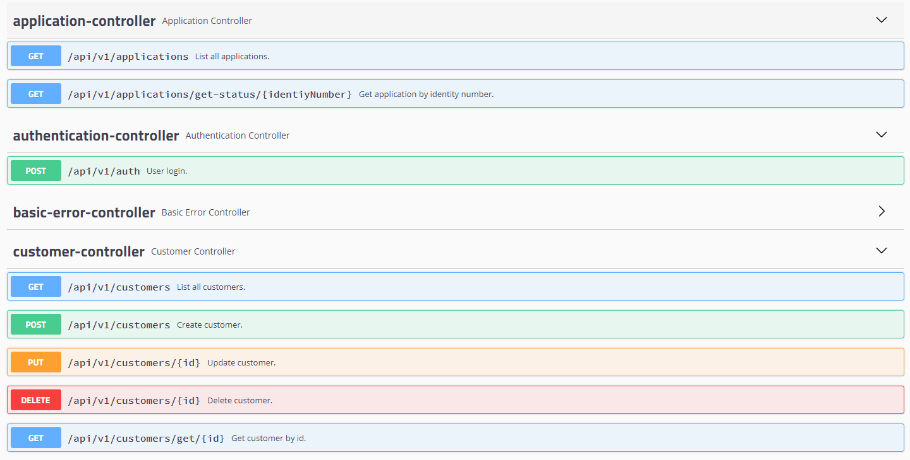

# GittiGidiyor Java Spring Bootcamp Graduation Project
Credit Application System with Spring Boot and ReactJS

- #### Backend live on [https://gittigidiyor-project-backend.herokuapp.com/swagger-ui.html](https://gittigidiyor-project-backend.herokuapp.com/swagger-ui.html)

---

#### Login information
- username: admin
- password: password

---

- #### Frontend live on [https://gittigidiyor-project-frontend.netlify.app/](https://gittigidiyor-project-frontend.netlify.app/)

## Used Technologies

- Java 8
- Spring Boot
- Spring Data JPA
- Restful API
- Swagger documentation
- MapStruct
- Lombok
- H2 database
- JUnit Mockito
- ReactJS for frontend
- Maven

## Run & Build

*$PORT: 8080*

```ssh

git clone https://github.com/nejlasahin/credit-application-system.git

$ cd credit-application-system/backend
$ mvn clean install
$ mvn spring-boot:run

$ cd credit-application-system/frontend
$ npm install
$ npm start

```
## Swagger UI will be run on this url

`http://localhost:${PORT}/swagger-ui.html`

## Api Endpoints




# Ödev Son Teslim Tarihi : 29 Eylül - Saat: 23:00


